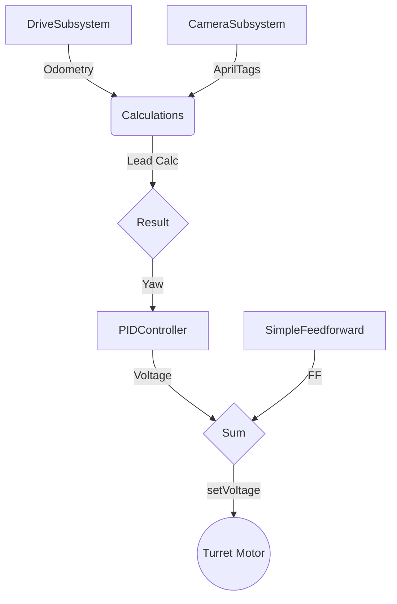
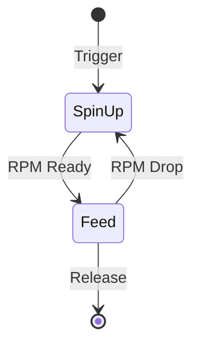
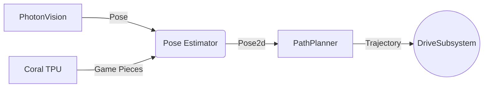

[](https://adoptium.net/)
[](https://docs.wpilib.org/)
[](https://github.com/MiamiBeachBots/2026-bot/actions)

---

This is the main codebase for Team 2026's 2026 robot (*REBUILT*). We're running a tank drive with a bunch of extra hardware: auto-aiming turret, PhotonVision for AprilTags, and a Coral TPU for onboard ML.

## Status

**Work in progress.** We've got the drive base setup and CAN IDs mapped out, but hardware testing is still pending.

| Component | State |
|:---|:---|
| Tank Drive | ✅ Init |
| CAN Mapping | ✅ Ready |
| Drive Test | ⚠️ Pending |
| Subsystems | 🚧 In Development |
| Autos | 🚧 TBD |

---

## Quick Start

```bash
git clone git@github.com:MiamiBeachBots/2026-bot.git
cd 2026-bot
./gradlew build        # pull deps + compile
./gradlew deploy       # push to RIO (needs robot wifi)
./gradlew simulateJava    # run it in sim
```

*Note: Make sure you're on the robot's wifi (10.20.26.x) before you try to deploy.*

---

## Technical Hub

Detailed guides for our workflow and system specs:

- **[Contributing](Contribguide)** — how we handle branches and PRs
- **[Style Guide](styleguide)** — code formatting (no tabs, please)
- **[Commit Guide](commitguide)** — naming conventions for git
- **[Controls](Controls)** — what button does what
- **[Deploy Guide](deploy-guide) / [Assist](Assist)** — setup and troubleshooting

---

## System Architecture

### Auto Aim Logic



### Fire Control



### Navigation



---

## CAN Bus Map

| ID | Subsystem | Motor | Type |
|:---:|:---|:---|:---|
| 1 | Drive | Front Right | NEO |
| 2 | Drive | Back Right | NEO |
| 3 | Drive | Front Left | NEO |
| 4 | Drive | Back Left | NEO |
| 5 | Intake | Main | NEO |
| 6 | Intake | Secondary | NEO |
| 7 | Loader | Motor 1 | NEO |
| 8 | Loader | Motor 2 | NEO |
| 9 | Loader | Motor 3 | NEO |
| 10 | Turret | Rotation | NEO |
| 11 | FireControl | Kicker | NEO |

---

## Sponsors

Thanks to our sponsors for keeping the lab running:

**Gene Haas Foundation · Waldom Electronics · Give Miami Day · Intuitive Foundation · MDCPS · Cordyceps Systems · MBSH PTSA · FIRST Robotics · Metal Supermarkets**

*Miami Beach Senior High — Miami Beach, Florida*
